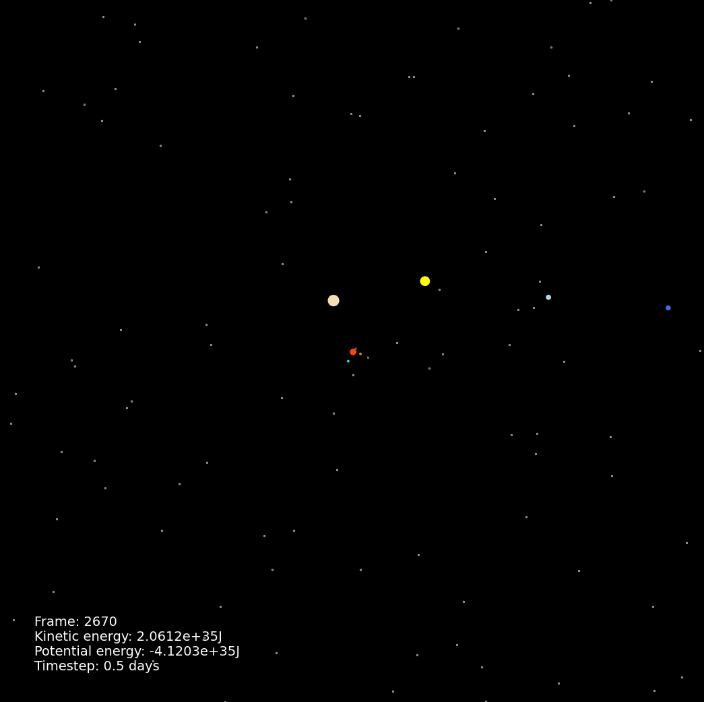

# Planet Orbit Simulator

## Overview
This is a planetary orbits simulator designed to simulate the orbits of planets in our Solar system. The project is built in Python, using Numpy and MatplotLib for computations and rendering. 

## Features
- Simulate free-body problem with adaptive Celestial objects.
- Visualize planets on a 2D MatplotLib window in real time.
- Customize simulation parameters directly from custom JSON files.
- Store and analyse data from CSV files across different simulations.

## Requirements
Requires Python 3.10 or greater. Uses MatplotLib and NumPy

##  Installation
1. Extract files containing the project
2. "cd" into the project directory containing this file.
3. To install the orbits module, run: `pip install -e .`.
4. To uninstall, run: `pip uninstall orbits`.

## Usage
1. "cd" into the project directory containing this file.
2. Type `python -m orbits` into the command line to run the orbits package.
3. Alternatively, run the `run.py` file by typing `python run.py`.
4. This will load the command line interface to edit the configurations of the simulation.
5. Type "help" to get a list of commands, or type "run" to run the simulation with default values.
6. Wait for the loading bar to reach 100%, then a window will appear, displaying the simulation.

## Project Structure
Orbits/\
├── results/\
│   ├── energy-data.csv\
│   └── ...\
├── src/\
│   ├── data/\
│   │   ├── solar_system.json  - Simulation parameters\
│   │   ├── test.json\
│   │   └── ...\
│   ├── orbits/\
│   │   ├── \_\_init__.py   - Module file\
│   │   ├── \_\_main__.py   - Main file that loads terminal prompt\
│   │   ├── config.py   - Paths/constants\
│   │   ├── orbit.py    - Simulation and MatplotLib window\
│   │   ├── celestials.py   - Contains Celestial class for planets\
│   │   ├── energy_comparison.py    - Handles plotting with gathered data\
│   │   └── progress_bar.py - Provides a loading bar to show progress\
│   └── tests/\
│       └── test.py        - Combined test file\
├── .gitignore\
├── conftest.py\
├── setup.py\
├── run.py\
└── README.md\